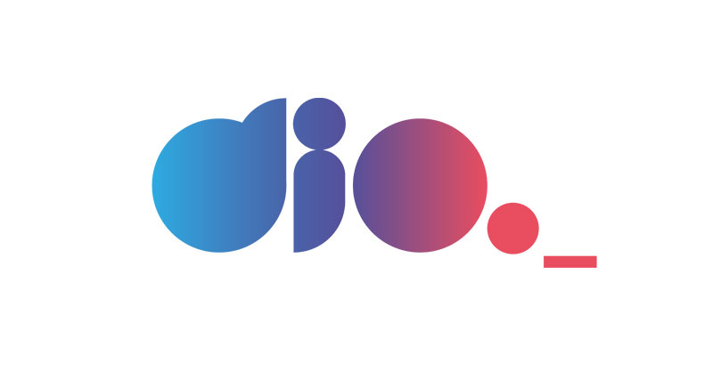
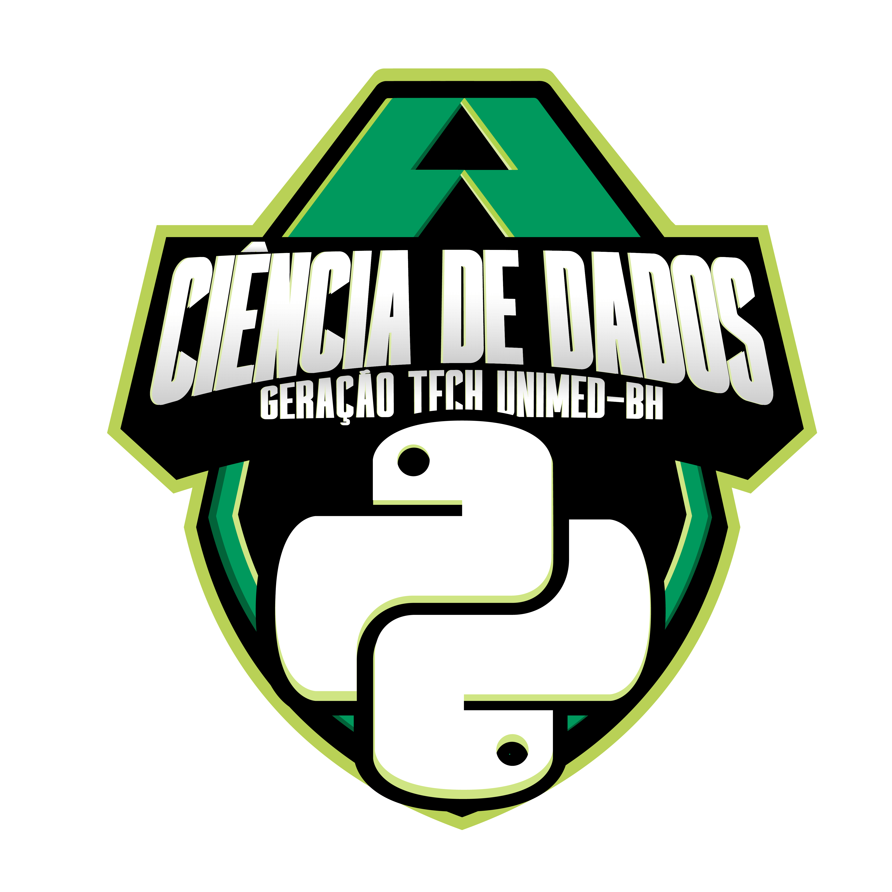

# Bootcamp Unimed
Códigos criado para utilização junto a plataforma Digital Innovation One Inc para o Programa Geração Tech Unimed - Ciência de Dados

## Introdução
Nese repositório documento todos os meus estudos, desafios e projetos para o Programa Geração Tech Unimed - Ciência de Dados, desde os desafios mais básicos, até projetos mais complexos.

Inicialmente usando o Google Colaboratory devivo a baixa complexidade dos problemas.

## Ementa
- Python para Cientistas de Dados
- Bancos de Dados SQL e NoSQL
- Imersão Cloud Computer
- Machine Learning

## Entregas
### Desafios de Códigos
- <a href="https://github.com/berggama/bootcamp_unimed/blob/main/Desafios_Iniciais_Python.ipynb">Desafios iniciais com Python</a>

- <a href="https://github.com/berggama/bootcamp_unimed/blob/main/desafios_intermediarios_python.ipynb">Desafios Intermediários com Python</a>

### Desafios de Projeto
- <a href="https://github.com/berggama/bootcamp_unimed/blob/main/An%C3%A1lise_Explorat%C3%B3ria_de_Dados_com_Python_e_Pandas_.ipynb">Análise de Dados com Python e Pandas</a>

- <a href="https://github.com/berggama/bootcamp_unimed/tree/main/package">Criação de pacotes em Python</a>

- <a href="https://github.com/berggama/bootcamp_unimed/blob/main/machine_learning_para_prever_evolu%C3%A7%C3%A3o_do_COVID_19_no_brasil.ipynb">Modelo com Python e Machine Learning para prever a evolução do COVID-19 no Brasil</a>

- <a href="https://github.com/berggama/bootcamp_unimed/blob/main/projeto_conceitual_de_banco_de_dados.md">Projeto Conceitual de Banco de Dados – E-COMMERCE</a>

